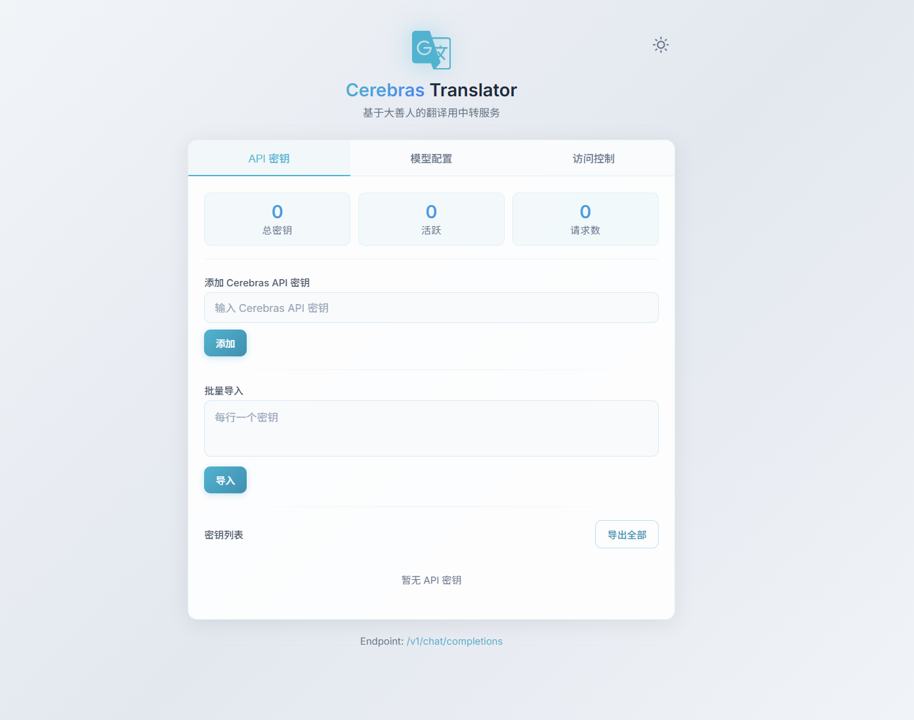
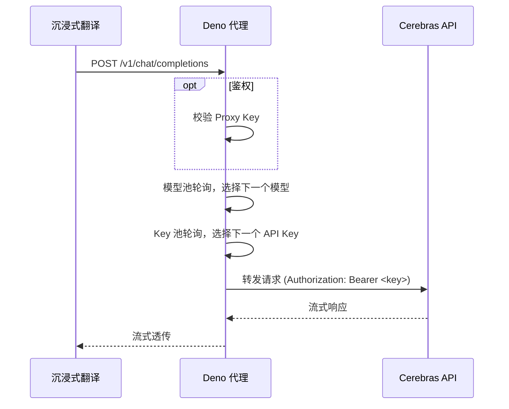

<p align="center">
  
  <h1 align="center">Cerebras Translator</h1>
  <h4 align="center">基于大善人的翻译用中转服务</h4>
</p>

<p align="center">
  
  
  
  
  
</p>

## Features

<div align="center">
  <p>Deno Deploy 配置</p>
  
</div>

本项目基于此专为沉浸式翻译设计，实现 Cerebras API 代理转发，支持：
- OpenAI 兼容入口
   - 代理对外暴露 `/v1/chat/completions` 和 `/v1/models`
   - 沉浸式翻译只需要把"上游地址"指向你的 Deno 部署地址即可
- CORS 处理与流式透传
   - 允许浏览器侧跨域调用，避免前端被浏览器拦截
   - 代理不消费/拼接上游返回流，直接把 `apiResponse.body` 透传给客户端，降低延迟与内存占用
- Cerebras API 密钥池管理 
  - 按请求轮换 key，把负载平均摊到多个 key 上
  - 支持单个密钥与模型测活，方便维护 key 池
- 代理访问密钥分发
   - 支持开关代理鉴权，创建代理密钥后自动开启
   - 支持分发给不同客户端，最多五个密钥
- 模型池轮询
  - 自动切换模型，进一步分散负载
  - 支持配置多个模型，请求时自动切换到池中下一个模型
  - 对外暴露统一模型名 `cerebras-translator`
- Web 管理面板 
  - 管理面板需要登录访问，确保数据安全
  - 可视化管理所有配置
  - 支持api key与分发 key 用量统计
- Deno KV 持久化
  - 配置与统计数据持久保存
  - 优化KV访问开销

## Disclaimer

> [!NOTE]
> 本项目仅供个人学习和研究使用。

- 请遵守 Cerebras 官方的使用条款和服务协议
- 禁止用于商业用途或大规模生产环境
- 使用者需自行承担因使用本项目而产生的任何风险和责任
- 作者不对因使用本项目导致的任何直接或间接损失负责

## License

本项目以 MIT License 开源，详见 `LICENSE`。

## Get Started

1. 获取 Cerebras Key:
   * 点击 [Cerebras官网](https://www.cerebras.ai/) 找右上角。

2. 部署到 Deno:
   * 打开 [Deno Deploy](https://dash.deno.com/) 并新建 `Playground`。
   * **傻瓜版（推荐）**：打开下面任意一个文件，全选复制后粘贴到 Playground 并部署：
     * `dist/deno.bundle.min.js`（推荐，体积更小）：https://github.com/zhu-jl18/thanks-to-cerebras/blob/bundle/dist/deno.bundle.min.js
     * `dist/deno.bundle.js`（可读版本）：https://github.com/zhu-jl18/thanks-to-cerebras/blob/bundle/dist/deno.bundle.js
   * **开发者版**：直接把 `deno.ts` 的代码粘贴进去并部署（或使用 GitHub 绑定部署）。
   * (Optional) 配置环境变量`KV_FLUSH_INTERVAL_MS=<刷盘间隔ms>`，默认 15000。
    <div align="center">
      <p>Deno Deploy 配置</p>
      
    </div>

3. 首次配置:
   * 访问 `https://<项目名>.deno.dev/`
   * **首次访问需设置管理密码**（至少 4 位）
   * 登录后在「API 密钥」标签页添加 Cerebras API 密钥
   * （可选）在「访问控制」标签页创建代理访问密钥

4. 配置沉浸式翻译:
   * API Key: 若未创建代理密钥则任意填写；若已创建则填写代理密钥（格式 `cpk_xxx`）
   * 上游地址: `https://<你的Deno项目名>.deno.dev/v1/chat/completions`
   * 模型: 任意填写，会自动映射到模型池轮询
<div align="center">
  <p>沉浸式翻译配置</p>
  
</div>


详细部署步骤与运维说明请查看 [部署指南](docs/GUIDE.md)。


## Short Glance at Implementation

一句话：把沉浸式翻译（OpenAI 风格请求）原样接进来，在代理里做最少的"管控"（鉴权/模型映射/Key 轮询），然后把响应流式转发回去。

处理流水线：



实现细节与成本说明请查看 [技术细节](docs/TECH_DETAILS.md)。

## Development

### 本地运行

```bash
deno run --allow-net --allow-env --allow-read --allow-write --unstable-kv deno.ts
```
KV 数据存储在 `.deno-kv-local/kv.sqlite3`。


### API 接口

代理接口：
- `POST /v1/chat/completions` - OpenAI 兼容，支持流式
- `GET /v1/models` - 返回模型列表

管理接口（需登录或传递鉴权密钥）：
- `GET/POST/DELETE /api/proxy-keys` - 代理密钥管理
- `GET/POST/DELETE /api/keys` - Cerebras API 密钥管理
- `GET/POST/DELETE /api/models` - 模型池管理
- `GET /api/stats` - 统计信息


## Acknowledgments

感谢 [Cerebras](https://www.cerebras.ai/) 提供免费AI推理服务。Cerebras 专注于高性能AI推理，免费用户每天可获得 1,000,000 tokens 调用额度，支持 Llama、Qwen 等开源模型。

<div align="center">
  <p>可用模型及其限制示意</p>
  
</div>

**你可能不需要这个项目** ：

Cerebras 官方本身提供了 OpenAI 兼容风格的 API（如 `/v1/chat/completions`）。如果你已经在用带面板/密钥池/轮询/限流的 AI Gateway（例如 NewAPI、gpt-load 等），直接把上游切到 Cerebras 即可。

这个仓库只是一个「个人用、轻量、可快速丢进 Deno Deploy 一键跑起来」的替代实现，主要服务于沉浸式翻译这种高并发小请求场景。


## 相关链接

- [Cerebras 官网](https://www.cerebras.ai/)
- [Deno Deploy](https://deno.com/deploy)
- [灵感来源](https://linux.do/t/topic/956453)
