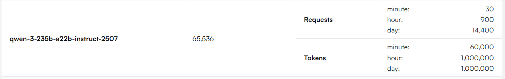
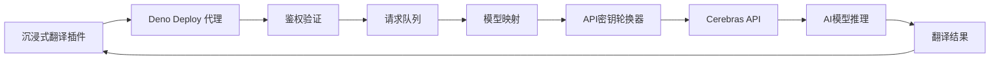
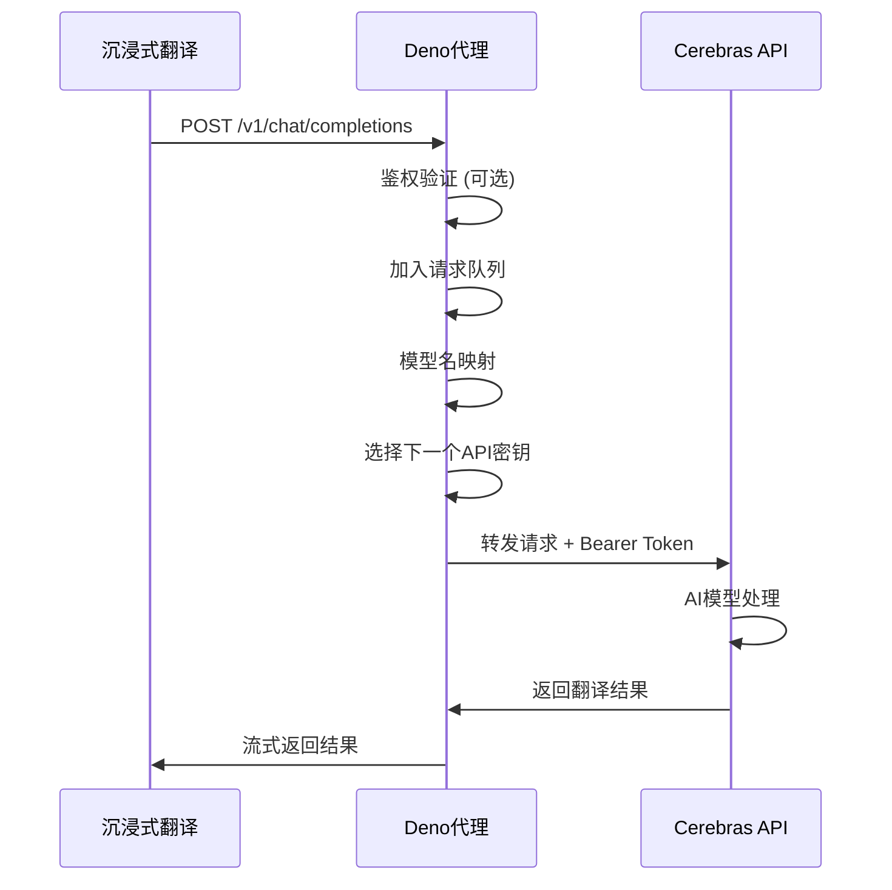
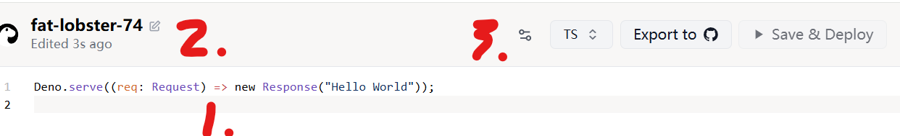
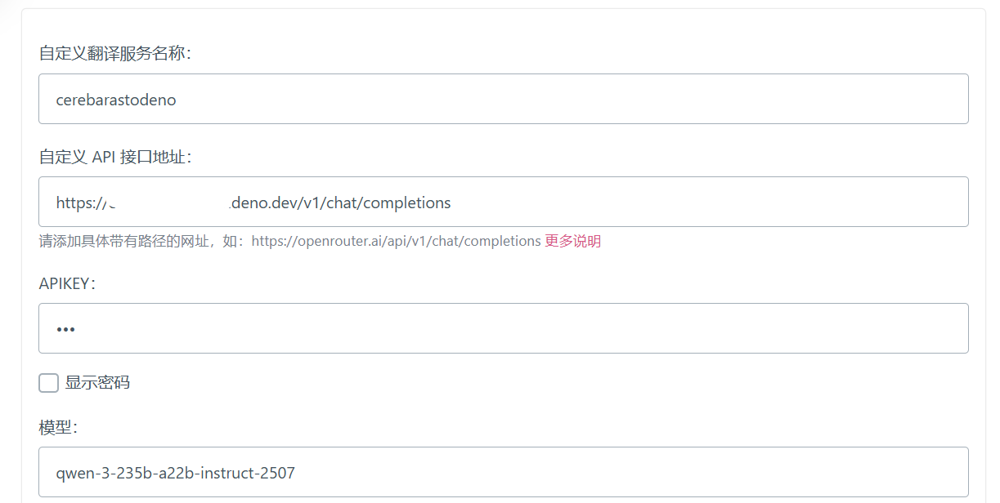

# Cerebras API 转发 for 沉浸式翻译

## 🙏 致谢
感谢 Cerebras 提供免费AI推理服务。

## ⚠️ 免责声明
本项目仅供个人学习和研究使用。

- 请遵守 Cerebras 官方的使用条款和服务协议
- 禁止用于商业用途或大规模生产环境
- 使用者需自行承担因使用本项目而产生的任何风险和责任
- 作者不对因使用本项目导致的任何直接或间接损失负责

## 📋 项目简介

Cerebras 专注于高性能AI推理，免费用户每天可获得 1,000,000 tokens 调用额度，支持 Llama、Qwen 等开源模型。

  
可用模型及其限制示意

  

本项目专为沉浸式翻译设计，实现 Cerebras API 代理转发，支持多API密钥轮换和请求限流。

建议注册多个 Cerebras 账号获取更多免费额度，项目内置轮询功能。

### 🔗 代码来源
本项目基于 [linux.do 社区分享](https://linux.do/t/topic/956453) 的代码改进而来。

## ⚙️ 技术原理

通过代理转发机制，将沉浸式翻译的请求路由至 Cerebras API。

### 核心架构

### 关键特性

- **可选鉴权**：支持通过环境变量设置访问密码
- **模型映射**：自动将任意模型名映射到指定模型
- **请求队列**：每200ms处理一个请求，避免速率限制
- **密钥轮换**：多个API密钥循环使用
- **错误处理**：异常捕获和CORS跨域支持
- **流式响应**：保持原始响应流

### 数据流程

## 🚀 快速部署

提供两个版本供选择：基础版和增强版（支持鉴权+模型默认映射）

### 🍳 快速部署1 - 基础版本

1.  **获取 Cerebras Key**:
     * 点击 [Cerebras官网](https://www.cerebras.ai/) 找右上角。
1.  **部署到 Deno**:
    *   打开 [Deno Deploy](https://dash.deno.com/) 并新建`Playground`。
    *   把`deno.ts` 的代码粘贴进去。
2.  **配置环境变量**:
    *   添加 `CEREBRAS_API_KEYS`。
    *   值填写 Cerebras Key，多个用英文逗号 `,` 分隔，不要留空。
3.  **配置沉浸式翻译**:
    *   **API Key**: 任意填写。
    *   **上游地址**: `https://<你的Deno项目名>.deno.dev/v1/chat/completions`。
    *   **模型**: `gpt-oss-120b` 或 `qwen-3-235b-a22b-instruct-2507`。

### 🆕 快速部署2 - 增强版本（推荐）

1.  **获取 Cerebras Key**:
     * 点击 [Cerebras官网](https://www.cerebras.ai/) 找右上角。
2.  **部署到 Deno**:
    *   打开 [Deno Deploy](https://dash.deno.com/) 并新建`Playground`。
    *   把`deno_new.ts` 的代码粘贴进去。
3.  **配置环境变量**:
    *   **必填**: 添加 `CEREBRAS_API_KEYS`，值填写 Cerebras Key，多个用英文逗号 `,` 分隔。
    *   **可选**: 添加 `AUTH_PASSWORD`，设置鉴权密码（不设置则无鉴权）。
4.  **配置沉浸式翻译**:
    *   **API Key**: 如果设置了 `AUTH_PASSWORD` 环境变量则填写密码，否则任意填写。
    *   **上游地址**: `https://<你的Deno项目名>.deno.dev/v1/chat/completions`。
    *   **模型**: 任意填写（如 `gpt-4`、`claude` 等），会自动映射到 `qwen-3-235b-a22b-instruct-2507`。

### 增强版特点
- 可通过环境变量 `AUTH_PASSWORD` 启用鉴权（可选）
- 支持模型名称自动映射，降低配置复杂度

### 📸 配置截图

  
Deno Deploy 配置

  

  
沉浸式翻译配置

  

## ✨ 未来计划

- to do
  - [ ] Docker 支持
  - [x] 技术原理解析
  - [x] 模型默认映射
  - [x] 简单鉴权

