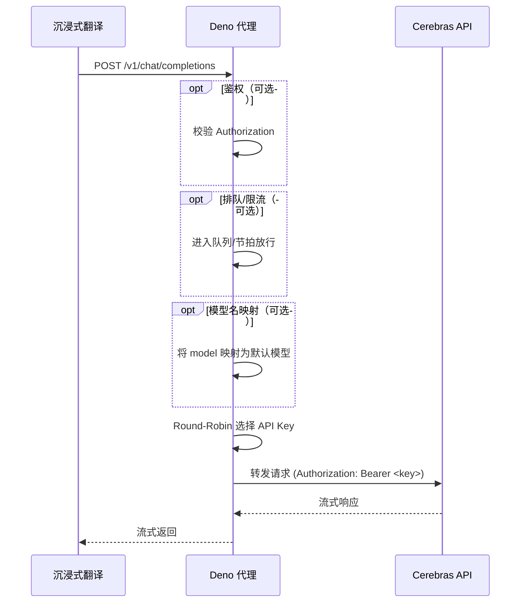

# Cerebras API 转发 for 沉浸式翻译

## 🙏 致谢
感谢 Cerebras 提供免费AI推理服务。

## ⚠️ 免责声明
本项目仅供个人学习和研究使用。 ⚠️ **代码和文档均由 Claude Code 自动生成。**

- 请遵守 Cerebras 官方的使用条款和服务协议
- 禁止用于商业用途或大规模生产环境
- 使用者需自行承担因使用本项目而产生的任何风险和责任
- 作者不对因使用本项目导致的任何直接或间接损失负责

## 📋 项目简介

Cerebras 专注于高性能AI推理，免费用户每天可获得 1,000,000 tokens 调用额度，支持 Llama、Qwen 等开源模型。

  
可用模型及其限制示意

  

本项目专为沉浸式翻译设计，实现 Cerebras API 代理转发，支持多API密钥轮换和请求限流。

也许可以注册多个 Cerebras 账号获取更多免费额度，项目内置轮询功能。

### 你可能不需要这个项目

Cerebras 官方本身提供了 OpenAI 兼容风格的 API（如 `/v1/chat/completions`）。如果你已经在用带面板/密钥池/轮询/限流的 AI Gateway（例如 NewAPI、gpt-load 等），直接把上游切到 Cerebras 即可。

这个仓库只是一个「个人用、轻量、可快速丢进 Deno Deploy 一键跑起来」的替代实现，主要服务于沉浸式翻译这种高并发小请求场景。

### 🔗 代码来源
本项目基于 [linux.do 社区分享](https://linux.do/t/topic/956453) 的代码改进而来。

## 🚀 快速部署

提供三个版本供选择：基础版、增强版（支持鉴权+模型默认映射）以及 Ultra 持久化版（附带 KV 管理面板）

### 🍳 快速部署1 - 基础版本

1.  **获取 Cerebras Key**:
     * 点击 [Cerebras官网](https://www.cerebras.ai/) 找右上角。
1.  **部署到 Deno**:
    *   打开 [Deno Deploy](https://dash.deno.com/) 并新建`Playground`。
    *   把`deno.ts` 的代码粘贴进去。
2.  **配置环境变量**:
    *   添加 `CEREBRAS_API_KEYS`。
    *   值填写 Cerebras Key，多个用英文逗号 `,` 分隔，不要留空。
3.  **配置沉浸式翻译**:
    *   **API Key**: 任意填写。
    *   **上游地址**: `https://<你的Deno项目名>.deno.dev/v1/chat/completions`。
    *   **模型**: `gpt-oss-120b` 或 `qwen-3-235b-a22b-instruct-2507`。

### 🆕 快速部署2 - 增强版本（推荐）

1.  **获取 Cerebras Key**:
     * 点击 [Cerebras官网](https://www.cerebras.ai/) 找右上角。
2.  **部署到 Deno**:
    *   打开 [Deno Deploy](https://dash.deno.com/) 并新建`Playground`。
    *   把`deno_new.ts` 的代码粘贴进去。
3.  **配置环境变量**:
    *   **必填**: 添加 `CEREBRAS_API_KEYS`，值填写 Cerebras Key，多个用英文逗号 `,` 分隔。
    *   **可选**: 添加 `AUTH_PASSWORD`，设置鉴权密码（不设置则无鉴权）。
4.  **配置沉浸式翻译**:
    *   **API Key**: 如果设置了 `AUTH_PASSWORD` 环境变量则填写密码，否则任意填写。
    *   **上游地址**: `https://<你的Deno项目名>.deno.dev/v1/chat/completions`。
    *   **模型**: 任意填写（如 `gpt-4`、`claude` 等），会自动映射到 `qwen-3-235b-a22b-instruct-2507`。

### 增强版特点
- 可通过环境变量 `AUTH_PASSWORD` 启用鉴权（可选）
- 支持模型名称自动映射，降低配置复杂度

### 🚀 快速部署3 - Ultra 持久化版

1. **获取 Cerebras Key**：
   * 同前两版，前往 [Cerebras 官网](https://www.cerebras.ai/) 申请并收集可用密钥。
2. **部署到 Deno**：
   * 在 [Deno Deploy](https://dash.deno.com/) 创建部署。
   * 将仓库中的 `deno_ui_ultra.ts` 粘贴至在线编辑器并部署。
3. **配置环境变量**：
   * **可选**：设置 `AUTH_PASSWORD`，开启代理鉴权；留空则对外无鉴权。
   * Ultra 版的密钥池与默认模型由 Web 管理面板持久化到 Deno KV，无需环境变量维护。
4. **配置沉浸式翻译**：
   * **API Key**：若设置了 `AUTH_PASSWORD`，填写该值；否则任意。
   * **上游地址**：`https://<你的 Deno 项目名>.deno.dev/v1/chat/completions`。
   * **模型**：任意填写，系统会自动映射到面板中配置的默认模型。

> 详细部署步骤与运维说明请查看 [KV 持久化部署指南](KV_DEPLOYMENT_GUIDE.md)。

### 📸 配置截图

  
Deno Deploy 配置

  

  
沉浸式翻译配置

  

## ⚙️ 技术原理

一句话：把沉浸式翻译（OpenAI 风格请求）原样接进来，在代理里做最少的“管控”（鉴权/模型映射/Key 轮询/可选限流），然后把响应流式转发回去。

### 共同原理（所有版本）

1. **OpenAI 兼容入口**
   - 代理对外暴露 `/v1/chat/completions`（以及部分版本提供 `/v1/models`）
   - 沉浸式翻译只需要把“上游地址”指向你的 Deno 部署地址即可
2. **CORS 处理**
   - 允许浏览器侧跨域调用，避免前端被浏览器拦截
3. **Key 轮询（Round-Robin）**
   - 代理维护一个 key 池，按请求轮换 key，尽可能把负载平均摊到多个账号/多个 key 上
4. **流式透传**
   - 代理不消费/拼接上游返回流，直接把 `apiResponse.body` 透传给客户端，降低延迟与内存占用

下面是“共同处理流水线”的 Mermaid（版本会在其中增删模块）：

### 版本差异（你该选哪个）

| 版本 | 文件 | 适合人群 | Key 来源 | 是否限流/排队 | 模型映射 | 面板 |
|---|---|---|---|---|---|---|
| 基础版 | `deno.ts` | 追求最小代码量 | 环境变量 `CEREBRAS_API_KEYS` | ✅ 有（固定节拍队列） | ❌ 无 | ❌ |
| 增强版（推荐） | `deno_new.ts` | 想要鉴权 + 免配模型名 | 环境变量 `CEREBRAS_API_KEYS` | ✅ 有（固定节拍队列） | ✅ 有（强制映射到默认模型） | ❌ |
| Ultra（KV 面板） | `deno_ui_ultra.ts` | 想要面板管理 key 池/默认模型，追求 0 等待 | Deno KV（面板持久化） | ❌ 默认关闭（直通，宁可 429） | ✅ 有（映射到面板默认模型） | ✅ |

### 限流到底怎么工作（只针对基础/增强版）

基础/增强版用的是“全局队列 + 固定出队间隔（`RATE_LIMIT_MS`）”。它的意义不是“永远不 429”，而是：当你的 key 数量不多时，通过排队把请求压到一个更稳的速率。

如果每个 key 的上限是 `30 rpm`，可以用这个经验公式估算：

- 单 key 间隔：`2000ms/req`（因为 30 rpm = 1 req / 2s）
- K 个 key 的总节拍上限：`T >= 2000 / K`（T 越小越快，但越可能 429）

例子（只给直觉，不需要你精确算）：

- 1 个 key：`RATE_LIMIT_MS ≈ 2000ms`
- 2 个 key：`≈ 1000ms`
- 5 个 key：`≈ 400ms`
- 10 个 key：`≈ 200ms`

Ultra 默认不做队列：你扔足够多的 key，就用“堆 key”来覆盖吞吐；不够就直接 429（符合沉浸式翻译“宁可失败也不要排队变慢”的体验取向）。

## ✨ 未来计划

- to do
  - [ ] Docker 支持
  - [x] UI面板
  - [x] 持久化存储
  - [x] 技术原理解析
  - [x] 模型默认映射
  - [x] 简单鉴权

